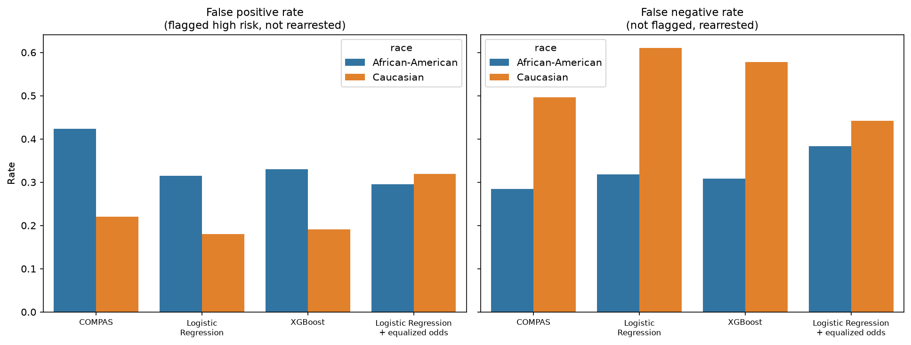

# Auditing Bias in Criminal Risk Scores (COMPAS)

An audit of the COMPAS recidivism risk score using Python, scikit-learn, XGBoost, and Fairlearn. I compare COMPAS with models I trained myself, measure error rates by race, and test one bias-mitigation method.

**Headline finding:** Among defendants who were **not** rearrested within two years, COMPAS flagged African-American defendants as medium or high risk about **1.9 times as often** as Caucasian defendants (42.3% vs. 22.0%). Models that never see race show a similar gap.



*COMPAS is scored on all 5,278 defendants in the two groups; the other three models are scored on a held-out 30% test set.*

## Key results

| Model | Group | False positive rate | False negative rate |
| :--- | :--- | :---: | :---: |
| COMPAS (score of 5 or above), all rows | African-American | 42.3% | 28.5% |
| | Caucasian | 22.0% | 49.6% |
| Logistic regression (test set) | African-American | 31.5% | 31.9% |
| | Caucasian | 18.0% | 61.0% |
| XGBoost (test set) | African-American | 33.0% | 30.8% |
| | Caucasian | 19.1% | 57.8% |
| Logistic regression + equalized odds (test set) | African-American | 29.5% | 38.3% |
| | Caucasian | 32.0% | 44.2% |

* **All three approaches reach about 67% overall accuracy.** A simple four-feature logistic regression matches COMPAS, and XGBoost adds nothing meaningful.
* **Removing race does not remove the gap.** Features such as prior offenses and age differ between the groups and likely carry the pattern.
* **Calibration and equal error rates conflict.** A given COMPAS score means a similar rearrest rate for both groups, but base rearrest rates differ (52.3% vs. 39.1%), so error rates cannot also be equal.
* **Mitigation has a cost.** Equalized odds post-processing shrank the false positive gap from 13.5 to 2.5 percentage points and the false negative gap from 29.1 to 5.9, at a cost of about 2.2 points of overall accuracy. It also raised the Caucasian false positive rate and uses different thresholds per group.

## Data

ProPublica's COMPAS dataset for Broward County, Florida ([propublica/compas-analysis](https://github.com/propublica/compas-analysis)). After ProPublica's filters, 6,172 defendants remain. This analysis compares the two largest groups, African-American (3,175) and Caucasian (2,103).

## Method

1. `src/clean.py` applies ProPublica's documented filters and saves a cleaned file.
2. `notebooks/02_eda.ipynb` explores base rates, score distributions, prior offenses, and calibration.
3. `notebooks/03_models.ipynb` trains logistic regression and XGBoost on age, priors, charge degree, and sex (race excluded), scores COMPAS with a cut-off of 5 or above, and computes error rates by race with Fairlearn.
4. Mitigation: Fairlearn's `ThresholdOptimizer` with an equalized odds constraint.

## How to run

```bash
git clone https://github.com/DeepCover-spec/compas-fairness-audit.git
cd compas-fairness-audit
python -m venv .venv
.venv\Scripts\activate        # Mac/Linux: source .venv/bin/activate
pip install -r requirements.txt
python src/clean.py
```
Then run the notebooks in `notebooks/` in order. Developed with Python 3.14.

## Limitations

* The outcome label measures **rearrest**, not proven reoffending, so it may reflect policing patterns.
* One county in Florida, and only two racial groups analysed.
* Differences are reported as observed values, without significance tests, and model results come from a single 70/30 split.
* COMPAS is scored on all rows and the other models on a 30% test set, so those rows are not directly comparable.
* My COMPAS error rates are a few points lower than ProPublica's published figures, possibly due to small differences in filtering or thresholds.
* The mitigation uses different thresholds for each racial group, which raises ethical and legal questions. This project describes the trade-off and does not recommend deploying it.

## Credit

Data and original analysis: ProPublica, "Machine Bias" (Angwin et al., 2016).